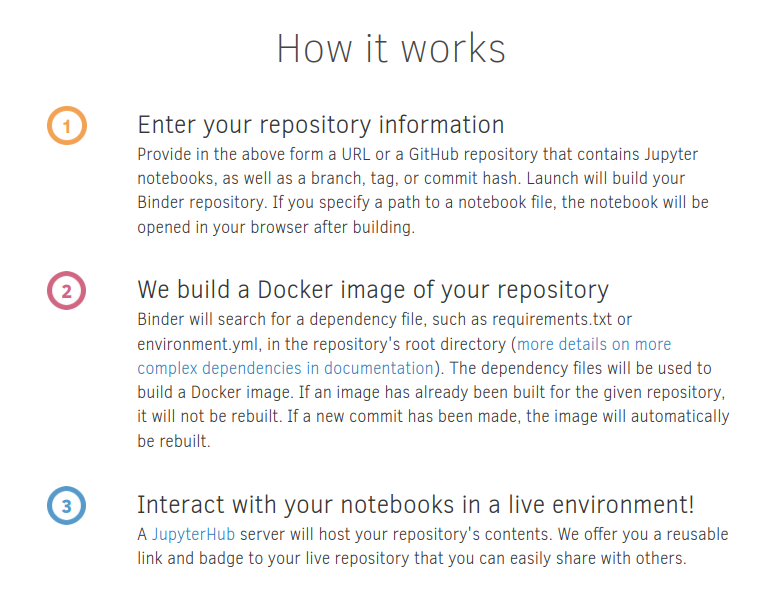
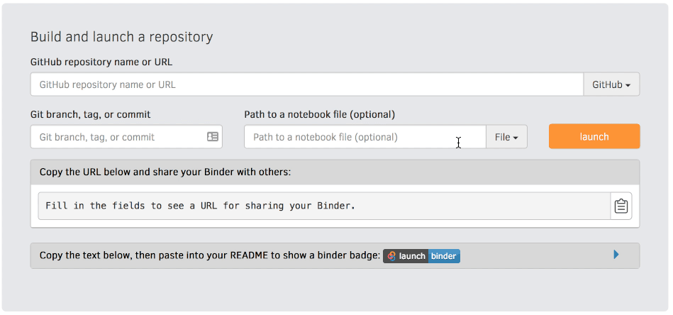

# Introduction to Binder and myBinder.org

The contents of this chapter comes from [Zero-to-Binder](https://the-turing-way.netlify.app/communication/binder/zero-to-binder.html) from the great [The Turing Way handbook to reproducible, ethical and collaborative data science](https://the-turing-way.netlify.app/welcome.html).

 Binder allows you to capture your data, code, and computational environment in a way that it can be easily shared with others that makes your research fully reproducible. [Introduction to Binder](https://ajstewartlang.github.io/23_introduction_to_binder/knitted_workshop/23_introduction_to_binder.html). [mybinder.org](mybinder.org) is a public service and proof of technological concept to execute code from repositories on a virtual environment that contains all the dependencies listed in the repository. Anyone can access and execute notebooks hosted in the platform.




## Launch your first repo!

1) Go to <https://mybinder.org>  

2) Type the URL of your repo into the "GitHub repo or URL" box. It should look like this:  
````
   > https://github.com/YOUR-USERNAME/my-first-binder  
````

3) As you type, the webpage generates a link in the "Copy the URL below..." box
   It should look like this:

````
   > https://mybinder.org/v2/gh/YOUR-USERNAME/my-first-binder/HEAD
````

4) Copy it, open a new browser tab and visit that URL  
   - You will see a "spinner" as Binder launches the repo

If everything ran smoothly, you'll see a JupyterLab interface.

While you wait, BinderHub (the backend of Binder) is:

- Fetching your repo from GitHub
- Analysing the contents
- Building a Docker image based on your repo
- Launching that Docker image in the cloud
- Connecting you to it via your browser


## Pinning Dependencies
Python

1) In your repo, create a file called `requirements.txt`

2) Add a line that says: `numpy==1.14.5`

3) Check for typos! Then commit to the `main` branch

4) Visit https://mybinder.org/v2/gh/YOUR-USERNAME/my-first-binder/HEAD again in a new tab

R

1) In your repo, create a file called `install.R`

2) Add a line that says: `install.packages("readr")`

3) Check for typos! Then commit to the `main` branch

4) Visit https://mybinder.org/v2/gh/YOUR-USERNAME/my-first-binder/HEAD again in a new tab

## Sharing your Work

Binder is all about sharing your work easily and there are two ways to do it:
- Share the https://mybinder.org/v2/gh/YOUR-USERNAME/my-first-binder/HEAD URL directly
- Visit [mybinder.org](https://mybinder.org), type in the URL of your repo and copy the Markdown or ReStructured Text snippet into your README.md file.

This snippet will render a badge that people can click, which looks like this: 

[](https://mybinder.org/v2/gh/spsrc/droplets/master?filepath=gaia_exploratory%2Fjupyter_exploratory.ipynb)


## Changing the Interface

Throughout this tutorial, we have been using the JupyterLab interface.
This is the default interface for newly created Binder instances.
However, this is not the only interface available on mybinder.org, the Classic Notebook view and RStudio are available too.
(An R environment needs to be installed for RStudio to be available.)

You can access the different interfaces in different ways.
The easiest way is to use the buttons in the JupyterLab Launcher, but you can provide URL parameters to directly open a specific interface (or file!) when the Binder instance launches.
We'll now cover three ways you can manipulate your Binder URL to navigate between interfaces.


### from inside a running Binder

Here is the structure of the URL inside a running Binder instance running JupyterLab:

````
https://<some-prefix>.mybinder.org/user/<name+repo>/lab
````

You can change the interface from JupyterLab to either the Classic Notebook or RStudio by changing the `/lab` part of the URL to:

- Classic Notebook: `/tree`
- RStudio: `/rstudio`

### by changing the mybinder.org launch link

Here is the launch link you have been using throughout this tutorial:

> https://mybinder.org/v2/gh/YOUR-USERNAME/my-first-binder/HEAD

You can access each interface by appending once of the following to the end of you URL:

- Jupyter Notebook: `?urlpath=tree`
- JupyterLab: `?urlpath=lab`
- RStudio: `?urlpath=rstudio`

### by using the mybinder.org form

You can also set the interface when constructing your launch link on the mybinder.org website (instead of editing the URL directly) as demonstrated in the below gif.



Use the "URL to open" option on the mybinder.org site to select your interface

# Examples

- [Try Jupyter](https://jupyter.org/try)
- [Sample repos](https://mybinder.readthedocs.io/en/latest/examples/sample_repos.html) with options
- [Rstudio examples](https://github.com/binder-examples/r)
- [Blast Binder](https://github.com/fomightez/blast-binder)
- [HCG-16](https://github.com/AMIGA-IAA/hcg-16)
- [HI-FRIENDS](https://github.com/HI-FRIENDS-SDC2/hi-friends)

