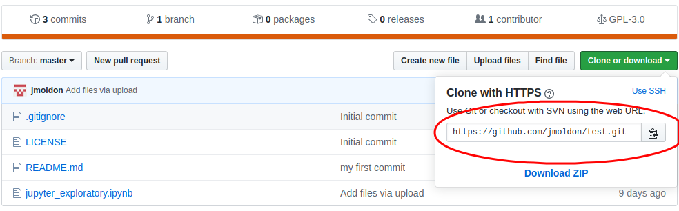
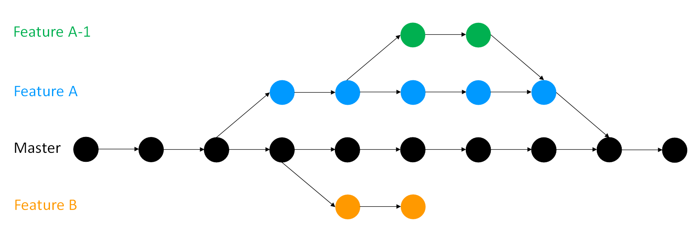

# Going full version control with git

You have received an e-mail from a good colleague.


!!! note "email from Galileo" 
    Hey there,

    Thanks for sharing the notebook with your exploratory analysis, the results are really promising! I have some code of my own to compute statistics. I attach it in this e-mail, I think this version compiled well (I hope).

    We can collaborate and do a more in-depth analysis together. How can we proceed?

    Cheers,

    Galileo


Starting a collaboration by sharing code and analysis by e-mail can be a mess. Most probably, a number of unconnected files, with different versions will appear, and tracking versions and stages will become more a more complicated as the project progresses. We need a tool that help us organize all our files, and make it simple and immediate to share exactly the same files with all your collaborators


<h3>Objectives and scope</h3>

In this section we will show how to use Git for version control and for collaboration with your colleagues. You will be able to track the changes of all the files in your project with a complete history so that you can recall specific versions later (continuous incremental backup). You will be able also to work in parallel with your collaborators in individual developments through "branching" and lately work back together with "merging", verifying that the changes on each branch do not conflict. We will learn:

- The basic workflow of Git (edit, add, commit)
- Synchronize your work online with Github
- Pull/push content from local repository from/to online repository
- Keep your files synchronized with your collaborators

The list of resources at [the end of this page](#other-resources) is also really useful to learn in more detail all the power of Git.

## Introduction to Git

Git is a widely used system (both in academia and industry) for version controlling files and
collaborating on code. It is used to track changes in (text) files, thereby establishing a history of all edits made to each file, together with short messages about each change and information about who made it. Git is mainly run from the command line, but there are several tools that have implemented a graphical user interface to run git commands.


#### Benefits of version control

There are many benefits of using git in your research project:

* You are automatically forced into a more organized way of working, which is usually a first step towards reproducibility.
* If you have made some changes to a file and realize that those were probably not a good idea after all, it is simple to view exactly what the changes were and revert them.
* If there is more than one person involved in the project, git makes it easy to collaborate by tracking all edits made by each person. It will also handle any potential conflicting edits.
* Using a cloud-based repository hosting service (the one you push your commits to), like e.g. [Github](https://github.com/), [Gitlab](https://about.gitlab.com/) or [Bitbucket](https://bitbucket.org/), adds additional features, such as being able to discuss the project, comment on edits, or report issues.
* At some point your project will be published. Github/Gitlab/Bitbucket (or similar) are excellent places to publicly distribute your code. Other researchers can then use git to access the code needed for reproducing your results, in exactly the state it was when used for the publication.
* If needed, you can host private repositories on Github/Gitlab/Bitbucket as well. This may be convenient during an ongoing research project, before it is publicly published.

The best way to get an idea about git is simply to start using it. The tutorial below will guide you through the essential steps, with a focus on what is needed for making a project reproducible. There are many additional features of both git and the web-based repository hosting services (like Github and Bitbucket) that are not included here. If you are interested in learning more, the web is filled with information (see some examples below)!

#### The basic workflow

Using version control for tracking your files, and edits to those, is an essential step in making your computational research reproducible. A typical git workflow consists of:

* **Write or edit** one or several files. 
* **Commit** those changes. This will create a snapshot of the work at this time, and git will include the edits to the history, together with a message about what those changes involve.
* (Optionally) **push** the new version of your files to a remote repository (i.e. syncing your local project directory with one in the cloud).

Keep doing work and making more and more snapshots. You can think of these as savepoints - if you need to go back to any point in time because of a mistake, or changing your mind about a decision, you can go back to get a file as it was then, or just return your entire project to a past state. An illustration of this is shown in the figure below.


## Getting started (clone)

Chances are that you already have git installed on your computer. You can check by running e.g. `git --version`. If you don't have git, install it following the instructions [here](https://git-scm.com/book/en/v2/Getting-Started-Installing-Git).

Converting a local folder in your computer into a git repository is as easy as running in a terminal `git init`, but that would create an isolated repository that is not connected to a Github repository in the cloud. To avoid having to connect it later, we will start with an existing Github repository, like the one you created in the previous section [Collaborative science online, Github](github.md)

You need to find the path to your repository and clone it to your local computer:


```console
$ git clone https://github.com/jmoldon/test.git
$ cd test
$ git remote -v
origin  git@github.com:jmoldon/test.git (fetch)
origin  git@github.com:jmoldon/test.git (push)
```

The last command is simply to verify that the local repository is connected to the right Github repository.

## Working with git locally

We will follow a simple 3-steps tutorial to demonstrate the basic workflow. In a terminal, you should be in the directory you just cloned from Github and practice this sequence:

**1: Add a new file to the repo**  
Create a file `my_sources.txt` and edit it with your favourite editor to add a few lines. For example, this is the file I created:

```console
$ more my_sources.txt 
m81
m87
m44
```

**2: Add the file to the staging environment**  
This will tell git which files we want to consider to update in the history.

```console
$ git add my_sources.txt
$ git status
On branch master

No commits yet

Changes to be committed:
  (use "git rm --cached <file>..." to unstage)

	new file:   my_sources.txt
```

Always use `git status`, it gives you information on the status of the repository and what to do next. Now git knows that you are ready to save the contents of the file `my_sources.txt` into the history. This is called **staging** a file. If you had more files, you could stage them in one go with `git add .`.


**3: Create a commit**
This will include the change in the repository history

```console
$ git commit -m "I have created a file with my favourite sources"
[master (root-commit) 57d6d77] I have created a file with my favourite sources
 1 file changed, 3 insertions(+)
 create mode 100644 my_sources.txt
$ git status
On branch master
nothing to commit, working tree clean
```

That's it. You have done a whole process of incorporating a change in the repository. Let's do a second iteration on this basic process: edit + add + commit. The first command will add a new line at the end of the file. You can use your editor to modify the file in other ways. If you want, add or remove more lines from the file.

```console
$ echo m101 >> my_sources.txt 
$ more my_sources.txt 
m81
m87
m44
m101
$ git add .
$ git commit -m "Include a new source m101"
[master de8f676] Include a new source m101
 1 file changed, 1 insertion(+)
```

Let's repeat the cycle, but now by adding a new file. In this case we will download it from the web:

```console
$ wget http://skyserver.sdss.org/dr14/en/tools/places/messier.csv
--2020-02-26 14:05:48--  http://skyserver.sdss.org/dr14/en/tools/places/messier.csv
Resolving skyserver.sdss.org (skyserver.sdss.org)... 128.220.233.141
Connecting to skyserver.sdss.org (skyserver.sdss.org)|128.220.233.141|:80... connected.
HTTP request sent, awaiting response... 200 OK
Length: 537 [application/octet-stream]
Saving to: ‘messier.csv’

messier.csv                   100%[==============================================>]     537  --.-KB/s    in 0s      

2020-02-26 14:05:48 (23,9 MB/s) - ‘messier.csv’ saved [537/537]

$ git add .
$ git commit -m "Include a complete csv list of messier objects"
[master d3c8fb5] Include a complete csv list of messier objects
 1 file changed, 7 insertions(+)
 create mode 100644 messier.csv
```

We can continue adding files and making changes. You don't need to commit after every minor change. The best practice is:

- Commit often.
- But, commits should be ‘atomic’. That is, they should do one simple thing and they should do it completely.
- Commit messages should be meaningful, clearly explaining why or how the files changes (you will thank yourself in the future for that).

So it is recommended that you make as many changes to as many files as you want as long as the changes have a common purpose. Then, you `add` (stage) all the files that contain relevant changes, and you `commit` with a simple message that describes the changes.

Finally, to see the full history of your work you can do:

```console
$ git log
commit a54070dca06d4fda51371c7cd1867c226f69ee1d (HEAD -> master)
Author: jmoldon <jmoldon@iaa.es>
Date:   Wed Feb 26 14:50:48 2020 +0100

    Include a complete csv list of messier objects

commit a2f81402e03bd087addd6bbd8c995976833d524e
Author: jmoldon <jmoldon@iaa.es>
Date:   Wed Feb 26 14:50:27 2020 +0100

    Include a new source m101

commit 9ef93d5b39cd90af1605c6573ab16b3becb2d637
Author: jmoldon <jmoldon@iaa.es>
Date:   Wed Feb 26 14:50:17 2020 +0100

    I have created a file with my favourite sources

```

The log will show the history of changes, when were they committed and who did the change. Each commit is automatically tagged with a unique string of numbers and letters called a SHA which you can use to access and compare them.


## Retrieving past versions (checkout)

!!! note "email from Galileo" 
    As you told me, I'm using git to track of my files and I commit every significant change. However, I changed a file the other day but I need to go back to the old version. Can you help me with it?


Your directory will show the latest version of your file, but git keeps track of all the changes that happened to all the files. Now we want to see the file 'my_sources.txt' exactly as it was before including the m101 source. We can do this:

1. Check your history to identify the commit you want to travel to. The 'online' option shows short SHA codes that can be used instead of the whole long code:

```console
$ git log --oneline
a54070d (HEAD -> master) Include a complete csv list of messier objects
a2f8140 Include a new source m101
9ef93d5 I have created a file with my favourite sources
```

From the three commits, we are interested in temporary reverting to the status saved in the first commit, at the bottom. Your short-SHA code will be different!

```console
$ git checkout 9ef93d5
Note: checking out '9ef93d5'.

You are in 'detached HEAD' state. You can look around, make experimental
changes and commit them, and you can discard any commits you make in this
state without impacting any branches by performing another checkout.

If you want to create a new branch to retain commits you create, you may
do so (now or later) by using -b with the checkout command again. Example:

  git checkout -b <new-branch-name>

HEAD is now at 9ef93d5 I have created a file with my favourite sources
$ more my_sources.txt 
m81
m87
m44
```

Good, the entry m101 has dissapeared from my file (we have recovered the original version). But also, we have gone back to the time before we downloaded the file. Because git reverted also that change, the file `messier.csv` is no longer in the directory:

```console
$ ls
my_sources.txt
$ git log --oneline
9ef93d5 (HEAD) I have created a file with my favourite sources
```

Literally, all the changes that were committed are now undone, the file we downloaded does not exist, and the history does not show the discarted events. **We have travelled back in time!** You can look at files, run tests, and even edit files without worrying about losing the current state of the project. You can recover the most recent state of your project with:

```console
$ git checkout master
Previous HEAD position was 9ef93d5 I have created a file with my favourite sources
Switched to branch 'master'
$ git log --oneline
a54070d (HEAD -> master) Include a complete csv list of messier objects
a2f8140 Include a new source m101
9ef93d5 I have created a file with my favourite sources
$ ls
messier.csv  my_sources.txt
```

You may just want to check an old version of a single file but not the previous version of the whole project. To retrieve a single file use

```console
$ git checkout 9ef93d5 -- my_sources.txt
$ # Check the file and when you are done, go back to the most recent version
$ git checkout master -- my_sources.txt
```

!!! tip
    To make sure git keeps track of all file managing you can use use `git rm`, `git mv`.


## Comparing versions (diff)

!!! note "email from Galileo" 
    
    OK, I understand checkout, but sometimes I just want to quickly see what has changed in a file without too much time travel.


You can compare versions of files as they were in different commits. Again, run 'git log' to see your SHA codes

```console
$ git log --oneline
a54070d (HEAD -> master) Include a complete csv list of messier objects
a2f8140 Include a new source m101
9ef93d5 I have created a file with my favourite sources
```
And then visualize the differences between two commits with
```console
$ git diff 9ef93d5 a2f8140
diff --git a/my_sources.txt b/my_sources.txt
index 1aadb42..84c3786 100644
--- a/my_sources.txt
+++ b/my_sources.txt
@@ -1,3 +1,4 @@
 m81
 m87
 m44
+m101
```

It will summarize what files are changed, with deleted lines starting with `-` and new lines starting with `+`. You can also choose to compare only one particular file. General structure is:

```console
git diff SHA_a:your_file_name SHA_b:your_file_name
```

!!! tip
    If you only specify one SHA value, `git diff` will show the differences between the current version and the specified commit

## Sync with Github (push)

!!! note "email from Galileo" 
    Great, I have a new version of our analysis, with new scripts and results. I want to share it with you. Should I zip and send you the folder? Will you be able to see what changed?


As explained in the previous section [Collaborative science online, Github](github.md), sending updated files via email is poor practice. Instead, let's tell git to synchronize your local reposotory to Github so your collaborators have access to everything. Also, they will benefit from all the git/Github features: they will have access to the whole history, they will be able to checkout previous versions, see differences, revert changes, and understand how the project evolved thanks to the commit messages.

Because we cloned the repository before, git already knows where to push the changes in Github, remember the `git remote -v`. Before pushing, you should do one more `git status` to verify that all your changes have been committed. Then, just to

```
git push -u origin master
```

You can go to Github and note that your repository files and history have been recorded in the online repository. You, or your collaborators can now get the latest version by cloning the repository.

```
git clone https://github.com/your_username/repository_name.Git
```

When multiple people work on the same project (which is becoming more and more common as research becomes increasingly collaborative) it becomes easy to keep track of what changes have been made and by who if you use git. It is often difficult and time-consuming to manually incorporate the different participant’s work into a whole even if all of their changes are compatible. Git makes it easier for multiple (even hundreds) of collaborators to work on the same project and track all changes that occur. But sometimes...

## Update your local repo (pull)

!!! note "email from Galileo" 
    Catastrophe! I was making changes in my local repository and when I tried to push it to the Github repository a conflict appeared, somehow my changes were rejected! This is the error message:

```console
$ git push origin master
To https://github.com/jmoldon/test.git
 ! [rejected]        master -> master (fetch first)
error: failed to push some refs to 'https://github.com/jmoldon/test.git'
hint: Updates were rejected because the remote contains work that you do
hint: not have locally. This is usually caused by another repository pushing
hint: to the same ref. You may want to first integrate the remote changes
hint: (e.g., 'git pull ...') before pushing again.
hint: See the 'Note about fast-forwards' in 'git push --help' for details.
```

What happened is that, while you were working locally, someone else updated the online repository. Allowing you to push your changes without knowing what was changed could create conflicts difficult to solve. For that reason, git requests that you download the new content available online (pull from the online repository) so you can verify that your local changes are not in conflict with the newest version. To update your local history with the most updated version you have locally, you can do:

```console
$ git pull origin master
remote: Enumerating objects: 4, done.
remote: Counting objects: 100% (4/4), done.
remote: Compressing objects: 100% (2/2), done.
remote: Total 3 (delta 1), reused 0 (delta 0), pack-reused 0
Unpacking objects: 100% (3/3), done.
From https://github.com/jmoldon/test
 * branch            master     -> FETCH_HEAD
   0a6e5da..ccd036d  master     -> origin/master
Merge made by the 'recursive' strategy.
 online_change.txt | 1 +
 1 file changed, 1 insertion(+)
 create mode 100644 online_change.txt
```

In this particular example, the remote repo had a new file (online_change.txt) so updating your history was straightforward and now you have that file locally and your `git log` contains the commits that produced that file and one more commit because you merged the online changes with yours. 

If you want to replicate this problem, you can go to the Github page and create a new file online after clonning the repository. That way your local history will be different from the online history.

### Conflicts

Life is not always so easy. Git will try to find a way to incorporate your changes to the changes someone did (merge), and that is easy when the updated content does not overlap. But imagine that you have modified a file that someone else also modified, in particular the same lines. Git will not be able to solve the conflict, so you have the responsability to do so, manually.

When a merge conflict arises it will be flagged during the merge process. Within the files with conflicts the incompatible changes will be marked so you can fix them:

```
<<<<<<< HEAD
print('hello world!!!')
=======
print('Hello World')
>>>>>>> master
```

```<<<<<<<``` Indicates the start of the lines that had a merge conflict. The first set of lines are the lines from the file that you were trying to merge the changes into.

```=======``` Indicates the break point used for comparison. Breaks up changes that user has committed (above) to changes coming from merge (below) to visually see the differences.

```>>>>>>>``` Indicates the end of the lines that had a merge conflict.

#### Resolve the conflict

You resolve a conflict by editing the file to manually merge the parts of the file that Git had trouble merging. This may mean discarding either your changes or someone else’s or doing a mix of the two. You will also need to delete the <<<<<<<, =======, and >>>>>>> in the file. So in this project the user have to decide in favour of one version over another, or edit a new solution.

If you find there are particularly nasty conflicts and you want to abort the merge you can use:

```console
git merge --abort
```

Good practice: Before you start trying to resolve conflicts make sure you fully understand the changes and how they are incompatible. If you do not, you risk making things more tangled. Once you do and you go about fixing the problem be careful, but do not be afraid; the whole point of version control is your past versions are all safe. Nevertheless merge conflicts can be intimidating to resolve, especially if you are merging branches that diverged a great many commits ago which may now have many incompatibilities. This is why it is good practice to merge other’s changes into your work frequently.


!!! tip
    Note that `pull` consists of two stages: fetch and merge. The difference between `pull` and `fetch` is that `fetch` will just update git with the latest information of the remote status, whereas `pull` will try to integrate and sync those changes to your local clone directly.

    It is a good practice to fetch and compare the online repo before trying to merge them:

    ```console
    git fetch remote master
    git diff origin/master
    ```


## Next steps

Once you understand the basics of pull + edit + add + commit + push you have most of the work done. Git offers many other features that are very interesting. We will incorporate more in this page, but for the moment you can check the following resources:

- Branching. This is fundamental when projects become more complex, with more features integrated by more people. This image ilustrates very well what is the purpose of maintaining a master branch while developing new content in parallel branches. Each circle is a commit. You can read more details in the [The Turing Way - Version control - Branches](https://the-turing-way.netlify.com/version_control/version_control.html#branches)



- Pull requests. These are useful to manage what changes get integrated in the common online repository. You request that your changes are adopted (pulled) by the other contributors. Check this [Github guide](https://guides.github.com/activities/hello-world/#pr)

- Ignoring files. When you don't want to push raw data or products to Github. In general, it is a good idea to synchronize only source files, but not products. Read more here [NBIS - Ignoring files](https://nbis-reproducible-research.readthedocs.io/en/latest/git/#ignoring-files)

- More information on how to work with remotes can be find in the [git documentation](https://git-scm.com/book/en/v2/Git-Basics-Working-with-Remotes)

and many others. Git is a complex world. We recommend that you use the basic features and you start exploring more complex situations as you need them.

## Other resources

- [git - the simple guide](http://rogerdudler.github.io/git-guide/)
- The Turing Way chapter on [version control](https://git-scm.com/book/en/v2/Git-Basics-Working-with-Remotes). Droplets uses material from this very detailed book, check it out!
- [An Intro to Git and GitHub for Beginners](https://product.hubspot.com/blog/git-and-github-tutorial-for-beginners)
- [Learn Git](https://www.atlassian.com/git/tutorials/learn-git-with-bitbucket-cloud). This is a very nice resource.
- [NBIS - Introduction to Git](https://nbis-reproducible-research.readthedocs.io/en/latest/git/)
- [Github Hello World](https://guides.github.com/activities/hello-world/) example
- The [Git Book](https://git-scm.com/book/en/v2). A very detailed guide of everything
- [Try Git](https://try.github.io/). Very nice and funny interactive "Try me" resource.
- [Git for beginners: The definitive practical guide](https://stackoverflow.com/questions/315911/git-for-beginners-the-definitive-practical-guide). Very good quick reference for commands.
- [Google](https://www.google.com/) and [stackoverflow](https://stackoverflow.com/questions/tagged/git). You will need those.

