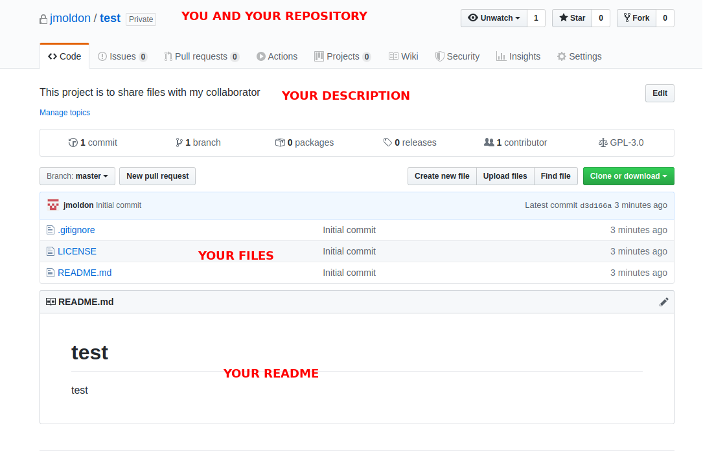

# Taking your research online

You have received an e-mail from a good colleague.


!!! note "email from Galileo"
    Hi again!

    Thanks a lot for sending me the Jupyter notebook you prepared, but actually I cannot open it. How can I do that? Also, I will be travelling during the following days, if you could send me something I can explore from my mobile phone, that would be great!

    Cheers,

    Galileo    


We need to compile all our results and send them in a format that helps
understanding the process and the results of our analysis. One common approach
is to describe all the details in the body of the e-mail and send different
figures as attachments. This is a poor approach that complicates visualization,
makes it difficult to connect description and figures, and that probably will
miss details on how the results were obtained. Alternatively, we can generate a
.doc document with descriptions, plots and comments that we can then convert to
pdf that anybody can open, but .docs files are difficult to update.  The
alternative we propose it using a Jupyter notebook, which has several
advantatges:

- It is easy to export as pdf or html, and can be visualized in nearly any platform.
- It naturally contains the results and the logic followed to obtain them, as already seen in the previous [chapter](docs/jupyter)
- You can seamlessly match explanations, code and results in a continuous narrative.
- You can easily update them, add or remove content or make small changes.
- It *explicitly* shows the full process used at each step.

<h3>Objectives and scope</h3>

In this section we will show how to use Github to share results with the community or your colleagues. You will be able to share code, text documents, figures or notebooks, which can be rendered automatically.


- Start an account
- Start a repo (Description, README, LICENSE)
- Upload files
- Make changes to file and commits
- View differences
- 


# What is Github and how does it work

GitHub is a code hosting platform for version control and collaboration. It
lets you and others work together on projects from anywhere. Developing your
project or analysis collaboratively on GitHub or GitLab provides a prompter to
document your work in detail and it provides a great opportunity to get
additional contributors to your idea. Contributions can be everything from new
ideas, to bug reports and actual code contributions.

The platform uses version control via git, so you will have a complete history
of all the changes for all the files, and when and who commited those changes.
So no more files ending with `_v2_final_reviewed_Feb_finalfinal.pdf`.
Additionally, you have an issue tracker to focus discussions on specific topics
easy, a build-in wiki, and even space to host web pages. For the moment, we
will focus on the specific features to solve the particular problem exposed in
this section: we need to share a document with a collaborator.

There are different platforms that can be used in a very similar way. We
recommend that you take a look at [Gitlab](https://about.gitlab.com/), and
[Bitcucket](https://bitbucket.org/product/). Here we will focus specifically in
a Github example, but most of the instructions and ways of working are almost
the same for the other platforms.


# Share your work with a collaborator

## Make an account

Just navigate to the [main page](https://github.com/) and you will be prompted
to Sign up in Github. Just enter your username, email and password. The
username will be used to identify you and also it will be used as home path for
all your repositories. Your email will be private. 

## Initialize a repository

A repository is usually used to organize a single project. Repositories can contain folders and files, images, videos, spreadsheets, and data sets – anything your project needs. 

- In the upper right corner, next to your avatar or identicon, click + and then select **New repository**. Name your repository, for example `test`.
- Write a short description of the purpose of this repository. You can write or change it later. For example: "This project is to share files with my collaborator"
- You can choose if you want to make it Public or Private. Public repos will be searchable by anyone, so the whole community will be able to access the files, comments, etc. Private repos will only be available to the users you explicitly invite.

!!! warning
    Github now offers unlimited private repositories, but those are limited to **three collaborators**. If that is not enough for you, we recommend using Gitlab (see a [comparison](https://about.gitlab.com/blog/2019/01/07/github-offering-free-private-repos-for-up-to-three-collaborators/))

- Select Initialize this repository with a README (see next section).
- Add a license. If in doubt read section below or select `GNU General Public License v3.0`.
- Add .gitignore: not very relevant now, but if it is a python-based project, select `Python`.

And you are good to go!

You will immediately see your repository located at `https://github.com/<username>/<reponame>`. You will see this:



You can navigate to the available files: .gitignore, LICENSE and README.md.


## Write a README file (make and commit changes)

It is always a good idea to have a README.md file in each repository, it will be useful for yourself and any visitor to know the details about the repository. README files are the welcome mat for your project. They are the first thing new visitors to your project will see and thus are part of a set of really important documents to make potential contributors feel welcome and invite them to get involved. Your README file should cover:

 - What you are doing, for who, and why.
 - What makes your project special and exciting.
 - How to get started.
 - Where to find key resources

We will practise how to make changes to a file with the README.md file.

- Click the ```README.md``` file. You will se the rendered version of the Markdown file.
- Click the pencil icon in the upper right corner of the file view to edit. You will see the plain-text Markdon file. You can use all the markdown syntax features we saw in [Some Markdown basics](jupyter.md#some-markdown-basics). Write some more details about the repository, at leas a few separate lines. Also, remove some of the existing lines.
- Commit your changes so the file is actually modified. You can change the master branch (default) as we are not using other branches now.

On GitHub, saved changes are called **commits**. Each commit has an associated commit message, which is a description explaining why a particular change was made. **Commit** messages capture the history of your changes, so other contributors can understand what you’ve done and why.

## Check what changes have happened

First, go back to the repository by clicking on its name on the top of the
page. You will see that the README file now contains your changes. If you see
the "commits" section now should contain at least 2 (the initial commit when
you created the files in the repository, and the change you just commited).
Click on the `commits` section. You will see a list with the full history of
changes (commits) in your repository. A commit may contain changes from several
files. Click on the name of the first commit (or in the 7-letter code on the
right). You will see a `diff` view of the file, showing exactly which lines
were added, which were removed and which words were changed. Maybe your file
does not suffered significant changes, you can see a random example of a commit
[here](https://github.com/numpy/numpy/commit/ca1b13224ba397ac3f77f48c899e2adcea1de5db).

## Add new files - share your Jupyter notebook

The purpose of this repository was to share files with external collaborators.
Go back to the home page of your repository. On the right, before the list of
files you will see a menu with "Create new file", "Upload files" and "Find
file". Click on "Upload files" and find a file you would like to upload (note
that if your repository is public, any file you upload will be visible by
anyone).

Upload a Jupyter notebook. If you don't have any, you can upload the notebook
from the previous session, that you can find
[here](https://raw.githubusercontent.com/spsrc/droplets/master/gaia_exploratory/jupyter_exploratory.ipynb) or download it from a terminal with:

```bash
wget https://raw.githubusercontent.com/spsrc/droplets/master/gaia_exploratory/jupyter_exploratory.ipynb
```

Upload the file from your computer, write a commit message describing what you have done, and if you want update the README.md file to explain that the notebook is now available in the repository.

The uploaded files will show in the home page of the repository. If you navigate the the .ipynb file Github will render the contents for you. If you share that path to your collaborators, they will be able to see your analysis!

# Conclusions

With this information you can maintain a repository with the files you need for your research, including text files, notebooks, pdfs, images, etc. Github is not the right place to keep heavy files (limit is 10MB) or data. You can keep the files and notes for each project in a different repository if you want. At the minimum, you will always have a backup of all the relevant files.

This works well with a reduced number of collaborators, but it is also a good idea to use features like branches that allow you to work on a specific change or feature without disturbing the master branch. Once you are happy with the modification implemented in a particular branch, you can `merge` it with the master branch. We recommend you follow the [Hello World](https://guides.github.com/activities/hello-world/) example in the Github Guides. In the next section we will work on how to use the command-line tool `git` to manage all this changes and synchronize the contents of the Github webpage in your local computer.


