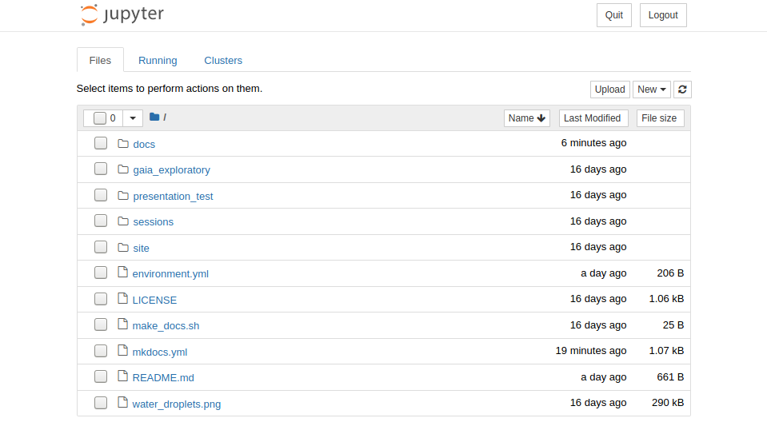
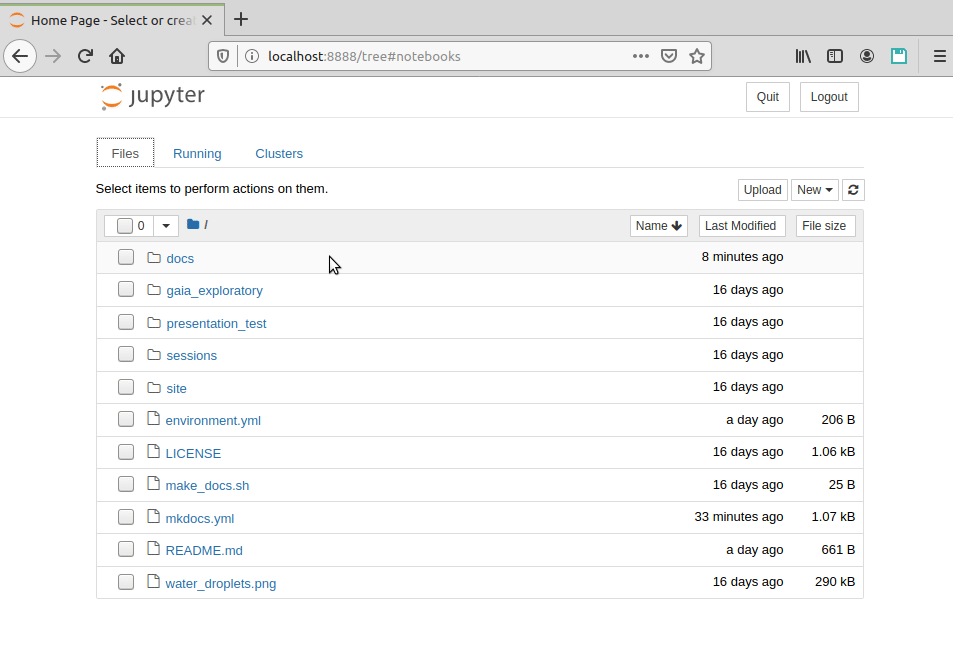
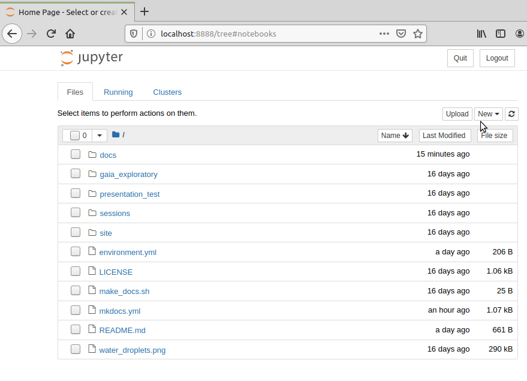

# The XXI century lab book

You have received an e-mail from a good colleague.


!!! note "email from Galileo"
    Hi!
    
    The other day my friend Ptolemy told me about a "nebulous mass in the breast of Cancer"[1]. I observed it with my new telescope and I could resolve about 40 individual stars! This is amazing, and it could be a good topic for a paper. If you have time, please see if you can find anything interesting in this region. 
 
    R.A. 130.025 deg  
    Dec. 19.9833 deg
    
    Best regards,
    
      Galileo

    [1] Claudius Ptolemy, Almagest, AD 100-170 (see [V/61](https://ui.adsabs.harvard.edu/abs/1987BICDS..33..125J/abstract))

You think it would be a good idea to explore the stellar population on this area. Because you are not sure what to expect you would like to try different approaches, so you decide to start a Jupyter notebook and explore a star catalog around those coordinates...

<h3>Objectives and scope</h3>

In this section we will see the value of Jupyter notebooks as a dynamic tool for exploratory analysis. We will learn how to initialize and navigate through notebooks, the basic structure and syntax to use a Jupyter notebook, the notebook cells and the Magic commands. As an example, we will do an exploratory analysis of a star population from the *[Gaia](https://sci.esa.int/web/gaia)* catalog.


<!---
Nice resources:

https://jupyter.org/try


-->

## Introduction to Jupyter notebooks
The Jupyter Notebook is an open-source web application that allows you to create and share documents that contain code, equations, visualizations and text. The functionality is partly overlapping with R Markdown (see the [tutorial](rmarkdown.md)), in that they both use markdown and code chunks to generate reports that integrate results of computations with the code that generated them. Jupyter Notebook comes from the Python community while R Markdown was developed by RStudio, but you could use most common programming languages in either alternative. In practice though, it's quite common that R developers use Jupyter but probably not very common that Python developers use RStudio.

#### What are Jupyter notebooks for?
An excellent question! Some applications could be:

* Python is lacking a really good IDE for doing exploratory scientific data analysis, like RStudio or Matlab. Some people use it simply as an alternative for that.
* The community around Jupyter notebooks is large and dynamic, and there are tons of tools for sharing, displaying or interacting with notebooks.
* An early ambition with Jupyter notebooks, and its predecessor IPython notebooks, was to be analogous to the lab notebook used in a wet lab. It would allow the data scientist to document her day-to-day work and interweave results, ideas, and hypotheses with the code. From a reproducibility perspective, this is one of the main advantages.
* Jupyter notebooks can be used, just as R Markdown, to provide a tighter connection between your data and your results by integrating results of computations with the code that generated them. They can also do this in an interactive way that makes them very appealing for sharing with others.

As always, the best way is to try it out yourself and decide what to use it for!

#### Understanding the Jupyter nomenclature

 - [Project Jupyter](https://jupyter.org/): is the **project** that develops open-source software, open-standards, and services for interactive computing across dozens of programming languages.
 - A Jupyter notebook: The actual `.ipynb` **file format** that constitutes the notebooks. It is actually a json file.
 - Jupyter Notebook: is the **web application** that you use for creating, managing and running notebooks. Can be executed in a terminal with `jupyter notebook` [Try me live](https://mybinder.org/v2/gh/ipython/ipython-in-depth/master?filepath=binder/Index.ipynb)
 - [Jupyter Lab](https://jupyterlab.readthedocs.io/en/stable/index.html): is the next-generation web-based user interface for Project Jupyter. An advanced web application that can be used to work with notebooks but also text files, csv files, images, pdfs, terminals, etc. Can be executed in a terminal with `jupyter lab`. [Try me live](https://mybinder.org/v2/gh/jupyterlab/jupyterlab-demo/try.jupyter.org?urlpath=lab)
- [JupyterHub](https://jupyterhub.readthedocs.io/en/stable/): a multi-user version that can serve multiple instances of Jupyter Notebook servers to be used for example in a class of students, a corporate workgroup or a research lab.


## The Jupyter Notebook dashboard
One thing that sets Jupyter Notebook apart from what you might be used to is that it's a web application, i.e. you edit and run your code from your browser. But first you have to start the Jupyter Notebook server.

```no-highlight
$ jupyter notebook
[I 19:37:44.483 NotebookApp] Serving notebooks from local directory: /home/jmoldon/droplets_dev/droplets
[I 19:37:44.483 NotebookApp] The Jupyter Notebook is running at:
[I 19:37:44.483 NotebookApp] http://localhost:8888/?token=f024f1e7495d4c99125c860951f3b0a4679890e312937e54
[I 19:37:44.483 NotebookApp]  or http://127.0.0.1:8888/?token=f024f1e7495d4c99125c860951f3b0a4679890e312937e54
[I 19:37:44.483 NotebookApp] Use Control-C to stop this server and shut down all kernels (twice to skip confirmation).
[C 19:37:44.519 NotebookApp] 
    
    To access the notebook, open this file in a browser:
        file:///home/jmoldon/.local/share/jupyter/runtime/nbserver-5881-open.html
    Or copy and paste one of these URLs:
        http://localhost:8888/?token=f024f1e7495d4c99125c860951f3b0a4679890e312937e54
     or http://127.0.0.1:8888/?token=f024f1e7495d4c99125c860951f3b0a4679890e312937e54
```

Jupyter Notebook probably opened up a web browser for you automatically, otherwise go to the address specified in the message in the terminal. Note that the server is running locally (as [http://localhost:8888](http://localhost:8888)) so this does not require that you have an active internet connection. The notebook server will be initialized in the local directory it was executed on, so you will see the files in that directory. The working path is also displayed in the first line of the terminal. Everything you do in your Notebook session will be stored in this directory, so you won't lose any work if you shut down the server.



What you're looking at is the Notebook dashboard. This is where you manage your files, notebooks, and kernels. The Files tab shows the files in your directory. The Running tab keeps track of all your processes. The third tab, Clusters, is used for parallel computing and won't be discussed further in this tutorial. You should see now the files of the droplets repository.

You can do several things, for example you can navigate to any file, for example click on the file `environment.yml` to see its contents. You can close the browser tap when finished. You can also Upload files or create new ones. You can even press New > Terminal to start a bash terminal in your web browser!




Let's start by creating an empty notebook by selecting the Files tab and clicking New > Notebook > Python. You can immediately write python code in the first cell, and execute it by pressing Alt+Enter. Your notebook will be saved as an `.ipynb` file. When you reopen the file, you will see the same state of the cells, including the python outputs.



Note that the notebook runs on a python instance (so python is continuously running on the background). You can see that by clicking in the Running tab, where you will see any terminal or notebook running, and you can shutdown them if you want. Note that if you close the notebook instance is equivalent as closing python, so any variables and functions will be lost, so you will need to run the cells again to go back to the processing stage.


