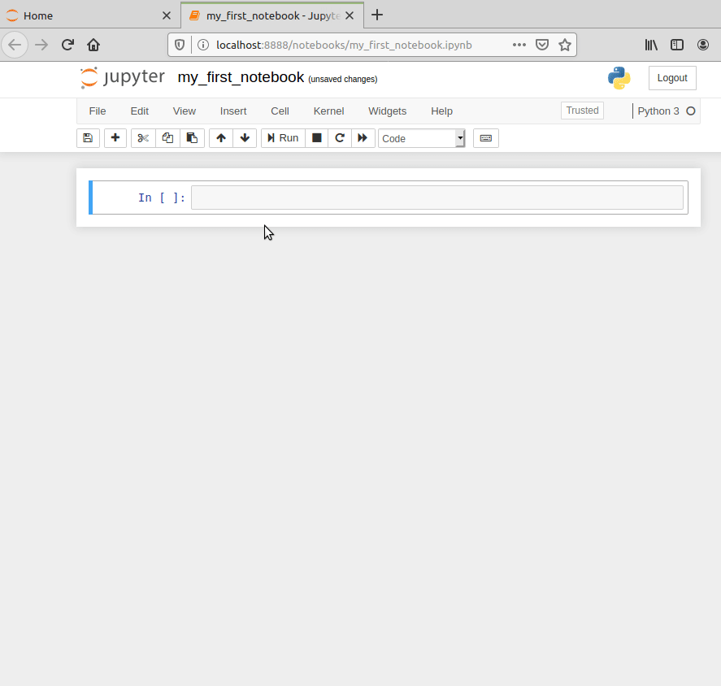
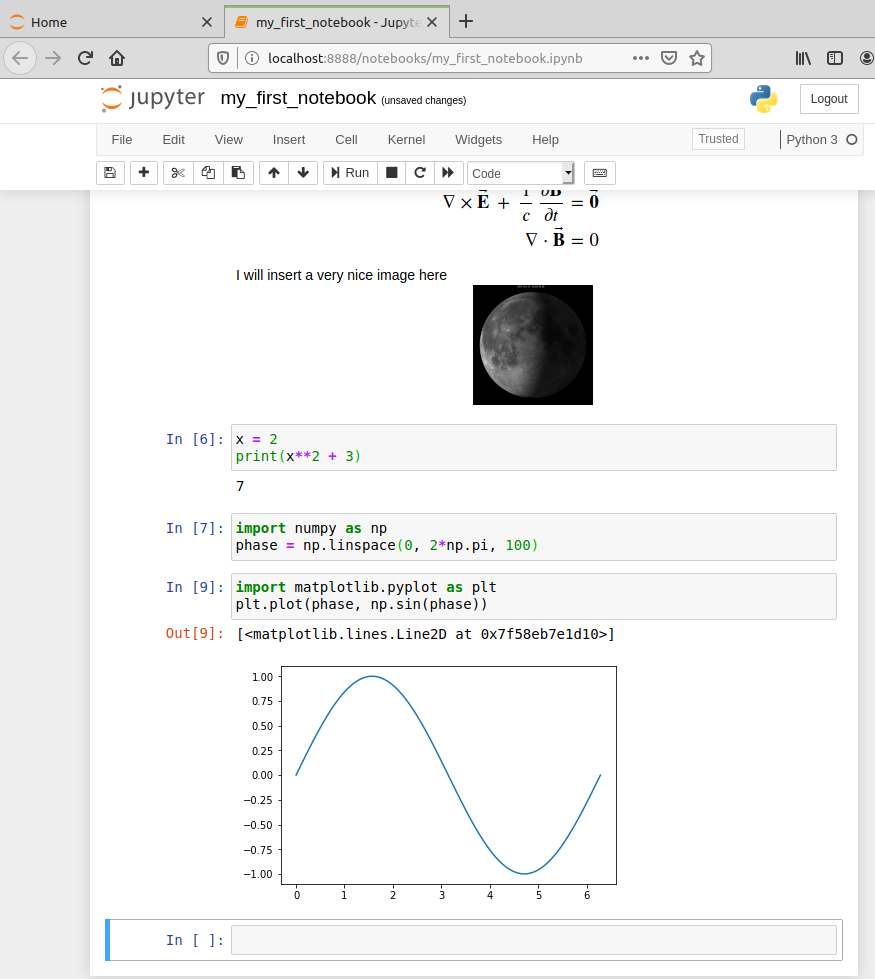
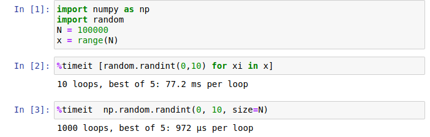
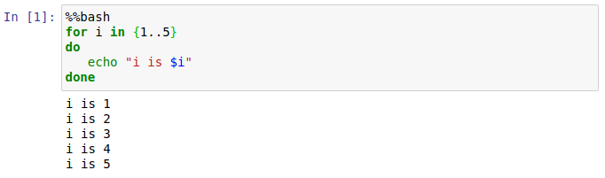
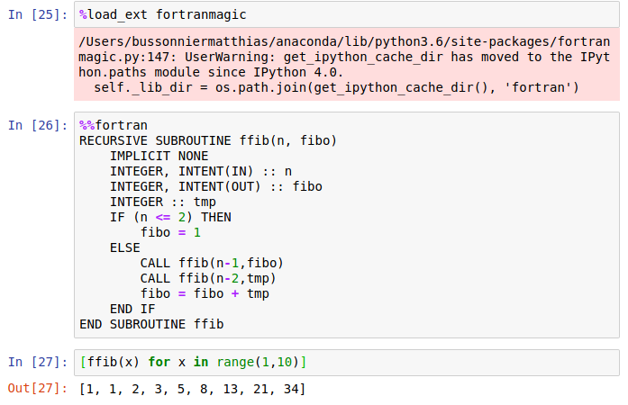

# The XXI century lab book

You have received an e-mail from a good colleague.


!!! note "email from Galileo"
    Hi!
    
    The other day my friend Ptolemy told me about a "nebulous mass in the breast of Cancer"[1]. I observed it with my new telescope and I could resolve about 40 individual stars! This is amazing, and it could be a good topic for a paper. Please, do a first exploratory analysis of the region and see what you can find.
 
    R.A. 130.025 deg  
    Dec. 19.9833 deg
    
    Best regards,
    
      Galileo

    [1] Claudius Ptolemy, Almagest, AD 100-170 (see [V/61](https://ui.adsabs.harvard.edu/abs/1987BICDS..33..125J/abstract))

You think it would be a good idea to explore the stellar population in this area. Because you are not sure what to expect you would like to try different approaches, so you decide to start a Jupyter notebook and explore a star catalogue around those coordinates...

<h3>Objectives and scope</h3>

In this section, we will see the value of Jupyter notebooks as a dynamic tool for exploratory analysis. We will learn how to initialize and navigate through notebooks, the basic structure and syntax to use a Jupyter notebook, the notebook cells and the Magic commands. 

We have prepared a notebook example to show an exploratory analysis of a moving cluster using data from the *[Gaia](https://sci.esa.int/web/gaia)* satellite. If you already now the basics of Jupyter notebooks, you can check the example in different formats:

- See how the final notebook looks like in github: [exploratory Gaia analysis](https://github.com/spsrc/droplets/blob/master/gaia_exploratory/jupyter_exploratory.ipynb)
- Execute and interact in a life version in Binder: [Binder exploratory Gaia analysis](https://mybinder.org/v2/gh/spsrc/droplets/master?filepath=gaia_exploratory%2Fjupyter_exploratory.ipynb)
- Try the notebook on your local machine (see [Quick Start](quickstart.md) for installation instructions).

Or, if you are new to Jupyter Notebook and  you want to learn how to work with notebooks from scratch, keep reading.

## Introduction to Jupyter notebooks
The Jupyter Notebook is an open-source web application that allows you to create and share documents that contain code, equations, visualizations and text. The functionality is partly overlapping with [R Markdown](https://rmarkdown.rstudio.com/), in that they both use markdown and code chunks to generate reports that integrate results of computations with the code that generated them. Jupyter Notebook comes from the Python community while R Markdown was developed by RStudio, but you could use most common programming languages in either alternative. In practice though, it's quite common that R developers use Jupyter but probably not very common that Python developers use RStudio.

#### What are Jupyter notebooks for?
An excellent question! Some applications could be:

* Python is lacking a really good IDE for doing exploratory scientific data analysis, like RStudio or Matlab. Some people use it simply as an alternative for that.
* An early ambition with Jupyter notebooks was to be analogous to the lab notebook used in a wet lab. It would allow the scientist to document her day-to-day work and interweave results, ideas, and hypotheses with the code. From a reproducibility perspective, this is one of the main advantages.
* Jupyter notebooks can be used to provide a tighter connection between your data and your results by integrating the results of computations with the code that generated them. They can also do this in an interactive way that makes them very appealing for sharing with others.
* Notebooks are great tools for teaching. It is common now to share lecture materials for training schools as notebooks (see examples in the [Resources](#other-resources) section)
* The community around Jupyter notebooks is large and dynamic, and there are tons of tools for sharing, displaying or interacting with notebooks.
* In a research team, notebooks can be used to train new people on the methods and types of analysis used in your field.

As always, the best way is to try it out yourself and decide what to use it for!

#### Understanding the Jupyter nomenclature

 - [Project Jupyter](https://jupyter.org/): is the **project** that develops open-source software, open-standards, and services for interactive computing across dozens of programming languages.
 - A Jupyter notebook: The actual `.ipynb` **file format** that constitutes the notebooks. It is actually a json file.
 - Jupyter Notebook: is the **web application** that you use for creating, managing and running notebooks. Can be executed in a terminal with `jupyter notebook` [Try me live](https://mybinder.org/v2/gh/ipython/ipython-in-depth/master?filepath=binder/Index.ipynb)
 - [Jupyter Lab](https://jupyterlab.readthedocs.io/en/stable/index.html): is the next-generation web-based user interface for Project Jupyter. An advanced web application that can be used to work with notebooks but also text files, csv files, images, pdfs, terminals, etc. Can be executed in a terminal with `jupyter lab`. [Try me live](https://mybinder.org/v2/gh/jupyterlab/jupyterlab-demo/try.jupyter.org?urlpath=lab)
- [JupyterHub](https://jupyterhub.readthedocs.io/en/stable/): a multi-user version that can serve multiple instances of Jupyter Notebook servers to be used for example in a class of students, a corporate workgroup or a research lab.


## The Jupyter Notebook dashboard
One thing that sets Jupyter Notebook apart from what you might be used to is that it's a web application, i.e. you edit and run your code from your browser. But first you have to start the Jupyter Notebook server.

```no-highlight
$ jupyter notebook
[I 19:37:44.483 NotebookApp] Serving notebooks from local directory: /home/jmoldon/droplets_dev/droplets
[I 19:37:44.483 NotebookApp] The Jupyter Notebook is running at:
[I 19:37:44.483 NotebookApp] http://localhost:8888/?token=f024f1e7495d4c99125c860951f3b0a4679890e312937e54
[I 19:37:44.483 NotebookApp]  or http://127.0.0.1:8888/?token=f024f1e7495d4c99125c860951f3b0a4679890e312937e54
[I 19:37:44.483 NotebookApp] Use Control-C to stop this server and shut down all kernels (twice to skip confirmation).
[C 19:37:44.519 NotebookApp] 
    
    To access the notebook, open this file in a browser:
        file:///home/jmoldon/.local/share/jupyter/runtime/nbserver-5881-open.html
    Or copy and paste one of these URLs:
        http://localhost:8888/?token=f024f1e7495d4c99125c860951f3b0a4679890e312937e54
     or http://127.0.0.1:8888/?token=f024f1e7495d4c99125c860951f3b0a4679890e312937e54
```

Jupyter Notebook probably opened up a web browser for you automatically, otherwise go to the address specified in the message in the terminal. Note that the server is running locally (as [http://localhost:8888](http://localhost:8888)) so this does not require that you have an active internet connection. The notebook server will be initialized in the local directory it was executed on, so you will see the files in that directory. The working path is also displayed in the first line of the terminal. Everything you do in your Notebook session will be stored in this directory, so you won't lose any work if you shut down the server.


What you're looking at is the Notebook dashboard. This is where you manage your files, notebooks, and kernels. The Files tab shows the files in your directory. The Running tab keeps track of all your processes. The third tab, Clusters, is used for parallel computing and won't be discussed further in this tutorial. You should see now the files of the droplets repository.

You can do several things: you can navigate to any file: for example, click on the file `environment.yml` to see its contents. You can close the browser tap when finished. You can also upload files or create new ones. You can even press New > Terminal to start a bash terminal in your web browser!


Let's start by creating an empty notebook by selecting the Files tab and clicking New > Notebook > Python. Notebooks can be executed on top of a Python3 kernel or any other kernel you want to install, more on that later. You can immediately write python code in the first cell, and execute it by pressing Alt+Enter. Your notebook will be saved as an `.ipynb` file. When you reopen the file, you will see the same state of the cells, including the python outputs.


Note that the notebook runs on a python instance (so python is continuously running on the background). You can see that by clicking in the Running tab, where you will see any terminal or notebook running, and you can shutdown them if you want. Note that if you close the notebook instance is equivalent as closing python, so any variables and functions will be lost, so you will need to run the cells again to go back to the processing stage.

If you navigate to gaia_exploratory you will see the notebook jupyter_exploratory.ipynb, which you can check and execute. Note that jupyter will save the contents of a modified file periodically, so you may overwrite the file. To avoid that, you can duplicate the file before editing it.

## The very basics
Jupyter notebooks are made up out of cells, and you are currently standing in the first cell in your notebook. The fact that it has a green border indicates that it's in "Edit mode", so you can write stuff in it.
A blue border indicates "Command mode" (see below).
Cells in Jupyter notebooks can be of two types: markdown or code.

* **Markdown** - These cells contain static material such as captions, text, lists, images and so on. You express this using Markdown, which is a lightweight markup language. Markdown documents are plain text files that can then be converted to other formats for viewing (the document you're reading now is written in Markdown and then converted to HTML). More details in the next section [Some Markdown basics](#some-markdown-basics)

* **Code** - These are the cells that actually do something, just as code chunks do in R Markdown. You can write code in dozens of languages and all do all kinds of clever tricks. You then run the code cell and any output the code generates, such as text or figures, will be displayed beneath the cell. We will get back to this in much more detail, but for now it's enough to understand that code cells are for executing code that is interpreted by a kernel (in this case the Python version in your Conda environment).

Before we continue, here are some shortcuts that can be useful. Note that they are only applicable when in command mode (blue frames). Most of them are also available from the menus.
These shortcuts are also available from the **Help** menu in your notebook (there's even an option there to edit shortcuts).


* <kbd>Enter</kbd>: enter Edit mode
* <kbd>Esc</kbd>: enter Command mode
* <kbd>Ctrl</kbd>+<kbd>Enter</kbd>: run the cell
* <kbd>Shift</kbd>+<kbd>Enter</kbd>: run the cell and select the cell below
* <kbd>Alt</kbd>+<kbd>Enter</kbd>: run the cell and insert a new cell below
* <kbd>Ctrl</kbd>+s: save the notebook
* <kbd>Tab</kbd>: for code completion or indentation
* m/y: toggle between Markdown and Code cells
* dd: delete a cell
* a/b: insert cells above/below the current cell
* x/c/v: cut/copy/paste cells
* o: toggle output of the current cell

## Some Markdown basics

Markdown is easy to use, you can find details on the syntax here [Markdown syntax](https://www.markdownguide.org/basic-syntax/). A nice online resource to practise is [Dillinger](https://dillinger.io/)

Let's use our first cell to create a header. Change the format from
Code to Markdown in the drop-down list above the cell. Double click on
the cell to enter editing mode (green frame) and input "# My notebook"
("#" is used in Markdown for header 1). Run the cell with Shift-Enter.
Tada!

Markdown is a simple way to structure your notebook into sections with
descriptive notes, lists, links, images etc.

Below are some examples of what you can do in markdown. Paste all or parts
of it into one or more cells in your notebook to see how it renders. Make
sure you set the cell type to Markdown.

```
## Introduction
In this notebook I will try out some of the **fantastic** concepts of Jupyter Notebooks. I can even insert a link, follow [here](https://jupyter-notebook.readthedocs.io/en/stable/examples/Notebook/Working%20With%20Markdown%20Cells.html) 

### Markdown basics
Examples of text attributes are:

* *italics*
* **bold**
* `monospace`

I will need some latex here:

\begin{align}
\nabla \times \vec{\mathbf{B}} -\, \frac1c\, \frac{\partial\vec{\mathbf{E}}}{\partial t} & = \frac{4\pi}{c}\vec{\mathbf{j}} \\   \nabla \cdot \vec{\mathbf{E}} & = 4 \pi \rho \\
\nabla \times \vec{\mathbf{E}}\, +\, \frac1c\, \frac{\partial\vec{\mathbf{B}}}{\partial t} & = \vec{\mathbf{0}} \\
\nabla \cdot \vec{\mathbf{B}} & = 0
\end{align}

I will insert a very nice image here 

```




## Writing code
Now let's write some code! Since we chose a Python kernel, Python would be the native language to run in a cell. Enter this code in the second cell and run it:

```python
x = 2
print(x**2 + 3)
```

Note how the output is displayed below the cell. This interactive way of working is one of the things that sets Jupyter Notebook apart from normal python scripts. Python scripts are executed top-to-bottom in one run, while you work *in* a Jupyter notebook in a different way. You decide when to run a cell, so you are responsible for the order cells are executed. 

!!! warning
    Executing the cells in non-linear order is very common but also dangerous because the state of the program (the value of the variables and the functions) depend on the order you executed the cells. It is highly recommended that, from time to time, you restart the Kernel using "Restart & Clear Output" or "Restart & Run All" from the Kerner menu to make sure that the execution is linear.

Variables defined in cells become variables in the global namespace. Therefore, you can share information between cells. Try to define a function or variable in one cell and use it in the next. For example:

```python
import numpy as np
phase = np.linspace(0, 2*np.pi, 100)
```

and

```python
import matplotlib.pyplot as plt
plt.plot(phase, np.sin(phase))
```

Your notebook should now look something like this.



The focus here is not on how to write Markdown or Python; you can make really pretty notebooks with Markdown and you can code whatever you want with Python. Rather, we will focus on the Jupyter Notebook features that allow you to do a little more than that.

## Additional notebook features

Here we show some features included in the notebooks to make your life easier. You can find this and more features [here](https://www.dataquest.io/blog/jupyter-notebook-tips-tricks-shortcuts/)

### Talking to the shell

Lastly, code cells also allow you to execute shell commands. This very handy functionality is possible by prepending the command with `!`. Try `!ls -l` in a cell to list the files in the current directory. You can use any of the common shell commands to copy, move, remove, cat, wget, etc.

As an exercise, you can explore the contents of files. For example, what **is** a Jupyter notebook? Let's look a little at the notebook we're currently working in. Jupyter Notebook saves it every minute or so, so you will already have it available. Try `!ls` to list the files in the current directory. Aha, we have a new file called `my_first_notebook.ipynb` or maybe `Untitled.ipynb` if you didn't save it before. This is our notebook. Look at the first ten lines of the file by using `!head my_first_notebook.ipynb`. Seems like it's just a plain old JSON file. Since it's a text file it's suitable for version control with for example Git, although json is a difficult format to visualize changes in the file. It turns out that Github and Jupyter notebooks are the best of friends, and Github can render notebooks so you can directly see the cell's inputs and outputs as we will see more of later.

### Magics
Magics constitute a simple command language that significantly extends the power of Jupyter notebooks. There are two types of Magics:

* Line Magics - Commands that are prepended by `%`, and whose arguments only extend to the end of the line.
* Cell Magics - Commands that start with `%%` and then applies to the whole cell. Must be written on the first line of a cell.

Now list all available Magics with `%lsmagic` (which itself is a Magic). You add a question mark to a Magic to show the help (e.g. `%lsmagic?`). Some of them act as shortcuts for commonly used shell commands (`%ls`, `%cp`, `%cat`, ..). Others are useful for debugging and optimizing your code (`%timeit`, `%debug`, `%prun`, ..).

For example, you can time the execution of a piece of code to benchmark its performance:



#### Visualize plots in the notebook
Python's favourite library for plotting, matplotlib, has its own Magic as well: `%matplotlib`. Try out the code below, and you should hopefully get a pretty sine wave.

```python
%matplotlib inline
import numpy as np
import matplotlib.pyplot as plt
x = np.linspace(0,3*np.pi,100)
y = np.sin(x)
fig = plt.figure()
ax = fig.add_subplot(111)
line, = plt.plot(x, y, 'r-')
fig.canvas.draw()
```
!!! tip
    The `%matplotlib inline` and similar line
    magics are only required once per notebook. You could, for instance,
    add them to the first cell where you import matplotlib for plotting.

#### Run code from a different kernel

If you want to, you can combine code from multiple kernels into one notebook.

Just use IPython Magics with the name of your kernel at the start of each cell that you want to use that Kernel for:

- `%%bash`
- `%%HTML`
- `%%python2`
- `%%python3`
- `%%ruby`
- `%%perl`




Do you have really good libraries in Fortran or C that you trust over anything and you don't want to port them to python. Great, Jupyter does not have a problem with that, you can use your functions seamlessly in your notebook cells. For this example you will need to install `pip install -U fortran-magic` and immediately run fortran code in the notebook:



Imagine the possibilities! You can also include C, perl, ruby code. You can run an interactive example in this [Binder multi-language demo](https://mybinder.org/v2/gh/binder-examples/multi-language-demo/master). Jupyter offers many Kernels to allow third-party interactions, you can see all of them in the [Jupyter kernels](https://github.com/jupyter/jupyter/wiki/Jupyter-kernels) page. Another good example of the use of the C++ library can be found in the [JupyterLab demo](https://mybinder.org/v2/gh/jupyterlab/jupyterlab-demo/try.jupyter.org?urlpath=lab) when you navigate to notebooks > Cpp.ipynb.

#### LaTeX formulas

As we have already seen, you can write formulas using the markdown cells. When you write LaTeX in a Markdown cell, it will be rendered as a formula using MathJax. Note that MathJax is a javascript program to render formulas but it will not have by default all the power of a full LaTeX installation.

This:

`$P(A \mid B) = \frac{P(B \mid A)P(A)}{P(B)}$`

becomes this:

$P(A \mid B) = \frac{P(B \mid A)P(A)}{P(B)}$


#### Capture 

A very useful magic, in particular when using shell commands a lot in your work, is `%%capture`. This will capture the stdout/stderr of any code cell and store them in a Python object. Run `%%capture?` to display the help and try to understand how it works. Try it out with either some Python code, other magics or shell commands.

```no-highlight
%%capture output
%%bash
echo "Print to stdout"
echo "Print to stderr" >&2
```

and in another cell

```python
print("stdout:" + output.stdout)
print("stderr:" + output.stderr)
```

## Running a Jupyter notebook from a remote server

Because Jupyter is basically a web app, you can visualize and interact with Jupyter even if it is running in a different machine (for example a large cluster). This means that the heavy processing can happen remotely while you interact with the notebook from your laptop. There are two options:

- If your server has a public IP address, you can directly connect to the notebook as if it was a web page. When you start the Jupyter server using the command line, it will display the IP and port serving the notebook, and the token (a unique identifier than can be used as a password to access the notebook).
- If you have ssh access to the server, you can create a tunnel of the server port to your local machine (keep reading).

We will show an example of how to run the second option. Imaging your local computer (for example your laptop or desktop) is called `mylaptop`, and that your remore server is called `mybigcomputer` where your username is `galileo`.

Open a terminal in your `mybigcomputer`:

```console
$ jupyter notebook --no-browser --port=9999
```

- "--no-browser": this starts the notebook without opening a browser
- "--port=9999": this sets the port for starting your notebook. Default is 8888

And leave it open, don't touch this terminal. You can choose a different port (8889 is just an example) if you want, but remember the number. 

Open a terminal on `mylaptop`:

```console
$ ssh -N  -L localhost:8890:localhost:9999 galileo@mybigcomputer
```

- "-N": suppresses the execution of a remote command, which means to forward it.
- "-L": this argument requires an input in the form of local_socket:remote_socket. Here we also specify the local and remote ports

If nothing at all happens, that is good! Again, the 8890 is an example, you can choose a different port number if you want. You need to leave this terminal running to keep the tunneling alive, so don't close it. Some manuals include a `-f` to the ssh command, which puts the ssh command in the background. We prefer that the command is running in the terminal so you can easily kill it when needed.

That's it, now in your laptop open a web browser and go to this address:

```
http://localhost:8890
```

For protection, you may be requested to introduce a token (a long alphanumerical code) that verifies that you have rights to access the notebook. That token is displayed in the mybigcomputer terminal when you started the jupyter notebook.

If you want to stop everything, press <kbd>Ctrl</kbd>+<kbd>C</kbd> on both terminals in mylaptop and mybigcomputer.

More details on this proceduce can be found in this blog post [Running a Jupyter notebook from a remote server](https://ljvmiranda921.github.io/notebook/2018/01/31/running-a-jupyter-notebook/).


!!! note "Quick recap"
    In this section we've learned:

    * That a Jupyter notebook consists of a series of cells, and that they can be either markdown or code cells.
    * That we execute the code in a code cell with the kernel that we chose when opening the notebook.
    * We can run shell commands by prepending them with `!`.
    * Jupyter Magics offer us the possibility to integrate advanced functionality or even code from different kernels.
    * A Jupyter notebook is simply a text file in JSON format.


# Other resources

- Jake VanderPlas youtube series on Reproducible data analysis with jupyter [Youtube](https://www.youtube.com/playlist?list=PLYCpMb24GpOC704uO9svUrihl-HY1tTJJ)
- Try Jupyter in your browser [link](https://jupyter.org/try)
- Quickview Notebook sharing the Gravitational Wave detection [Notebook](https://github.com/losc-tutorial/quickview/blob/master/index.ipynb)
- A full Machine Learning course using Notebooks, for example [Lecture 1: Density Estimation](https://github.com/carmensg/IAA_School2019/blob/master/lectures/Day3-ZeljkoIvezic/notebooks/density_estimation.ipynb), [Lecture 3: Classification](https://github.com/carmensg/IAA_School2019/blob/master/lectures/Day3-ZeljkoIvezic/notebooks/classification.ipynb) and [Lecture 4: Dimensionality Reduction](https://github.com/carmensg/IAA_School2019/blob/master/lectures/Day3-ZeljkoIvezic/notebooks/dimensionality_reduction.ipynb).
- Another example of the full tutorial contents on an international Python conference: [PyCon 2015 Scikit-learn Tutorial](https://github.com/jakevdp/sklearn_pycon2015)

Not everything is a fairy tale in Jupyter notebooks. So when you are ready to not like Jupyter notebooks you can read these discussions:  
- Blog post: [Why I Don't Like Jupyter](http://opiateforthemass.es/articles/why-i-dont-like-jupyter-fka-ipython-notebook/)  
- Blog post: [Why Jupyter Is Not My Ideal Notebook](https://www.sicara.ai/blog/2019-02-25-why-jupyter-not-my-ideal-notebook)  
- Youtube: [I don't like notebooks.- Joel Grus (Allen Institute for Artificial Intelligence)](https://www.youtube.com/watch?v=7jiPeIFXb6U)  
