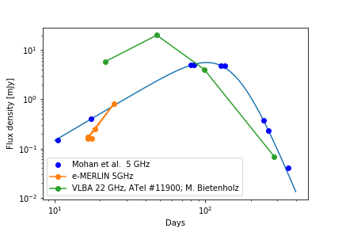

# title 1
- list entry 1
- list entry 2
- list entry 3

# title 2
- another list entry
- and yet onother one
- and finally the last one

# This is an image example

Here's an image of something:

# Some formula

$$y = x^2 \hbox{ when $x > 2$}$$ 

