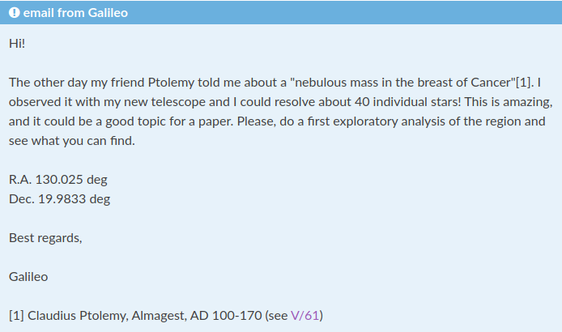

# Open Science Droplets 01
# Jupyter notebook, the XXI century lab book

You have received an e-mail from a good colleague.

## Session

We have prepared a notebook example to show an exploratory analysis of a moving cluster using data from the *[Gaia](https://sci.esa.int/web/gaia)* satellite. You can follow the example in different formats:

- See how the final notebook looks like in github: [exploratory Gaia analysis](https://github.com/spsrc/droplets/blob/master/gaia_exploratory/jupyter_exploratory.ipynb)
- Execute and interact in a life version in Binder: [Binder exploratory Gaia analysis](https://mybinder.org/v2/gh/spsrc/droplets/master?filepath=gaia_exploratory%2Fjupyter_exploratory.ipynb)
- Try the notebook on your local machine (see [Quick Start](https://droplets-spsrc.readthedocs.io/quickstart/) for installation instructions).

More details can be found in [this tutorial](https://droplets-spsrc.readthedocs.io/jupyter/)

## Objectives

- Jupyter notebooks as a dynamic tool for exploratory analysis
- Initialize a notebook
- Basic structure and syntax: cells

## Additional information
- droplets resources
- fortran magic
- Server options

## Summary (I)
- pros
  - Felixibility for exploratory data, training, sharing
  - Web app, accessible from anywhere (ssh, server)
  - Markdown + code + resuts. Science results are more "tangible"
  - Reports in different formats, dashboards
  - Many extensions, and growing!

## Summary (II)
- cons
  - Hidden state and out-of-order execution
  - Notebooks encourage bad habits (not ideal for software development)
  - In general, not as powerful as a stand-alone application or modules (not ideal for sharing good code)
  - Some difficulties to obtain diff

## Other resources

- Jake VanderPlas youtube series on Reproducible data analysis with jupyter [Youtube](https://www.youtube.com/playlist?list=PLYCpMb24GpOC704uO9svUrihl-HY1tTJJ)
- Try Jupyter in your browser [link](https://jupyter.org/try)
- Quickview Notebook sharing the Gravitational Wave detection [Notebook](https://github.com/losc-tutorial/quickview/blob/master/index.ipynb)
- A Machine Learning course using Notebooks: [Lecture 1: Density Est](https://github.com/carmensg/IAA_School2019/blob/master/lectures/Day3-ZeljkoIvezic/notebooks/density_estimation.ipynb), [Lecture 3: Classification](https://github.com/carmensg/IAA_School2019/blob/master/lectures/Day3-ZeljkoIvezic/notebooks/classification.ipynb) and [Lecture 4: Dimensionality Reduction](https://github.com/carmensg/IAA_School2019/blob/master/lectures/Day3-ZeljkoIvezic/notebooks/dimensionality_reduction.ipynb).
- The full tutorial on an international Python conference: [PyCon 2015 Scikit-learn Tutorial](https://github.com/jakevdp/sklearn_pycon2015)

## Take away

- Easy to learn tool
- Interweave results, ideas, and hypotheses with the code
- Natural format to create a scientific narrative
- State of scripts is not linear, depends on user
- Excellent tools to share your research

##  Next session

- March 16  
- Collaborative Jupyter notebooks through GitHub
