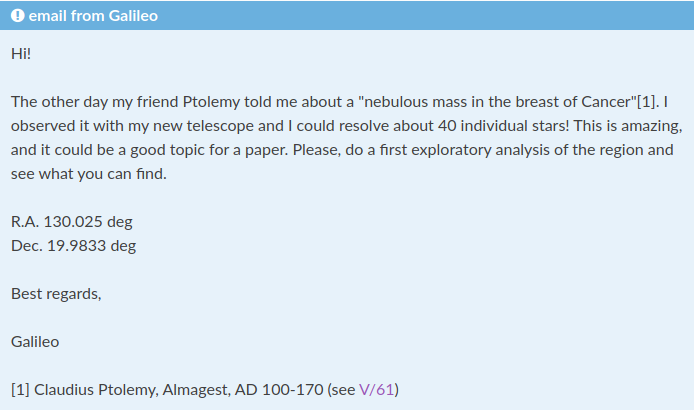

# 

# 

# email from Galileo

# Quote 
> Hi! 
>  
> The other day my friend Ptolemy told me about a "nebulous mass in the breast of Cancer"[1]. I observed it with my new telescope and I could resolve about 40 individual stars! This is amazing, and it could be a good topic for a paper. Please, do a first exploratory analysis of the region and see what you can find. 
>  
> R.A. 130.025 deg 
> Dec. 19.9833 deg 
>  
> Best regards, 
>  
> Galileo 
>  
> [1] Claudius Ptolemy, Almagest, AD 100-170 (see V/61) 

# Motivation

We understand that people will learn a tool only when they need it or they see the value on using it. Therefore, the tutorials follow the narrative of presenting tools after a scientific necessity appears, such as the necessity to share your work with colleagues or when you need to manage the dependencies of some software you need.

# Plan

To progressively incorporate new approaches:

- Jupyter: the XXI century lab book
- Collaborative Jupyter notebooks through git
- Software management with conda
- Python visualization and ipython widgets
- Share your results with the world with Binder
- Reproducible workflows to rule them all: Snakemake
- Contairenization for the posterit
- Your work for posterity. Zenodo

# Details

Resources and documentation:  
https://droplets-spsrc.readthedocs.io/en/latest/

Github repo:  
https://github.com/spsrc/droplets
