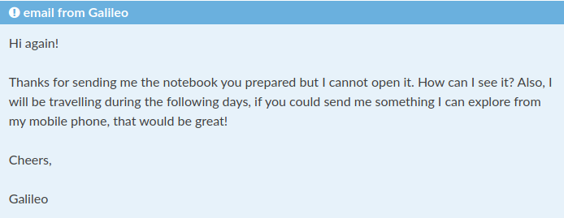

#

#

 

# Motivation
- In session 01 we created a Jupyter notebook
- Now we want to share it with our collaborator
- Includes version control
- Use an online service (persistent backup and availability)

# Requirements
- Account on github.com
# Create a repository on GitHub

- log into github.com (others: gitlab, bitbucket, etc)
- create and initialize a repository

# Share: Add the notebook to the repository
- Click upload files
- Choose the notebook from your PC

# Update the notebook
- jupyter lab # open and edit notebook
- git add
- git commit -m " here is my change "
- git push
- see updated notebook in web browser

# Collaborate: GitHub issues
- Open an issue in GitHub

# Problem
- My boss can see the notebook but cannot execute it
- Solutions in the next session!

# Reference Material
- To learn more: Github Guides https://guides.github.com/
- Jake Vanderplas: https://bit.ly/36z1IyG
- Which license to use? https://choosealicense.com/

