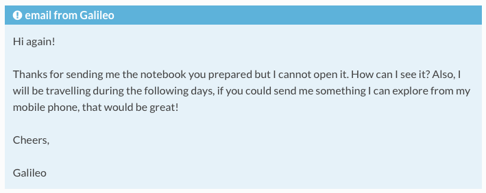

#

#

 

# Motivation
- In session 01 we created a Jupyter notebook
- Now we want to share it with our collaborator
- Include version control
- Use an online service (persistent backup and availability)
- First stage: basic functionality without git (no command line for now)

# Requirements
- Account on [github.com](https://github.com/) (or similar [Gitlab](https://about.gitlab.com/), [Bitcucket](https://bitbucket.org/product/))
- Something to share

# Plan 
- Start an account
- Start a repository (Description, README, LICENSE)
- Upload files
- Make changes to file and commit them
- View differences and history
- Share your work!
- Collaborate: issues

# New problem
- My colleague can see the notebook but cannot execute it
- Solutions in the next session!

# Reference Material
- To learn more: Github Guides https://guides.github.com/
- Jake Vanderplas: https://bit.ly/36z1IyG
- Which license to use? https://choosealicense.com/

